# 🚀 Real-Time Chat Application Backend

A scalable and feature-rich **real-time chat application backend** built with **Node.js, Express.js, TypeScript, MongoDB, Redis, Socket.IO, Cloudinary, Firebase Cloud Messaging, and Docker**.

The application supports **JWT authentication, direct and group conversations, real-time messaging, typing indicators, delivery/read status, message replies, editing, likes, voice and video messages, push notifications, Redis caching, and containerized deployment**.

---

## ✨ Features

### 🔐 Authentication & Security

* JWT Authentication
* Protected API Routes
* Password Hashing with bcrypt
* Socket.IO JWT Authentication
* Conversation Membership Validation
* Input Validation

### 👤 User Management

* Get All Users
* Get User by ID
* Search Users
* Update User Profile
* Avatar Upload
* Cloudinary Image Storage

### 💬 Conversations

* Direct / One-to-One Conversations
* Group Conversations
* Get My Conversations
* Add Participants
* Remove Participants
* Promote Members to Admin
* Rename Groups
* Conversation Room Management
* Redis Conversation Caching

### 📨 Messaging

* Text Messages
* Real-Time Messaging
* Image/File Support
* Voice Messages
* Video Messages
* Message Pagination
* Message Reply
* Message Edit
* Message Like / Unlike
* Delivery Status
* Read Status

### ⚡ Real-Time Features

* Socket.IO Authentication
* Join / Leave Conversation Rooms
* Real-Time Message Events
* Typing Indicators
* Delivery Updates
* Read Updates
* Online / Offline Status

### 🔔 Notifications

* Push Notification Token Registration
* New Message Notifications
* Voice Message Notifications
* Video Message Notifications
* Message Reply Notifications
* Group Message Notifications
* Group Activity Notifications
* Firebase Cloud Messaging Support

### 🧠 Infrastructure

* MongoDB Database
* Mongoose ODM
* Redis Caching
* Cloudinary Media Storage
* Docker
* Docker Compose
* TypeScript
* Environment-based Configuration

---

# 🛠 Tech Stack

| Category                | Technology               |
| ----------------------- | ------------------------ |
| Runtime                 | Node.js                  |
| Backend Framework       | Express.js               |
| Language                | TypeScript               |
| Database                | MongoDB                  |
| ODM                     | Mongoose                 |
| Cache                   | Redis                    |
| Real-Time Communication | Socket.IO                |
| Authentication          | JWT                      |
| Password Hashing        | bcrypt                   |
| Media Storage           | Cloudinary               |
| Push Notifications      | Firebase Cloud Messaging |
| Containerization        | Docker                   |
| Container Orchestration | Docker Compose           |

---

# 🏗 System Architecture
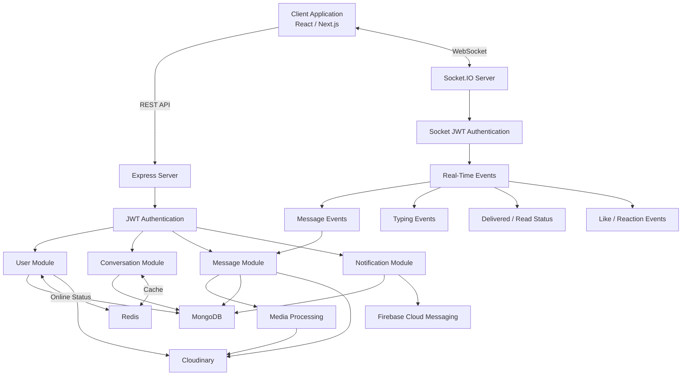


# 📊 System Diagrams


## 🐳 Docker Architecture

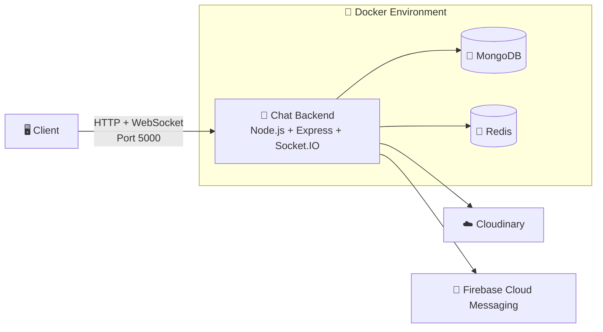

---

## 🔄 REST API Request Flow

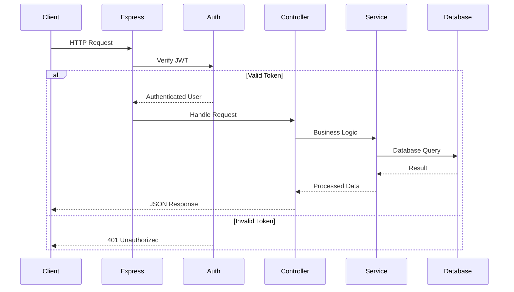

---

## ⚡ Real-Time Message Flow

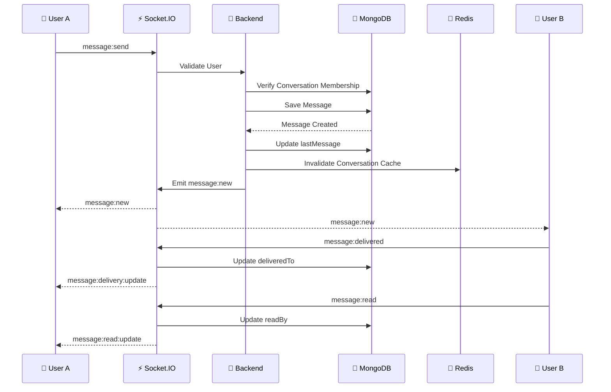

---

## ⌨️ Typing Indicator Flow

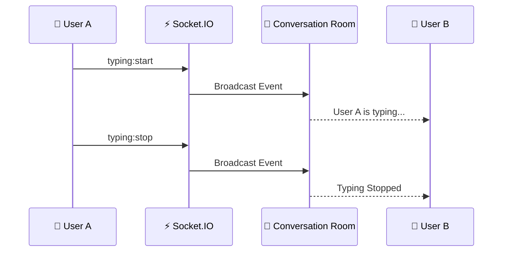

---

## 🔔 Push Notification Flow

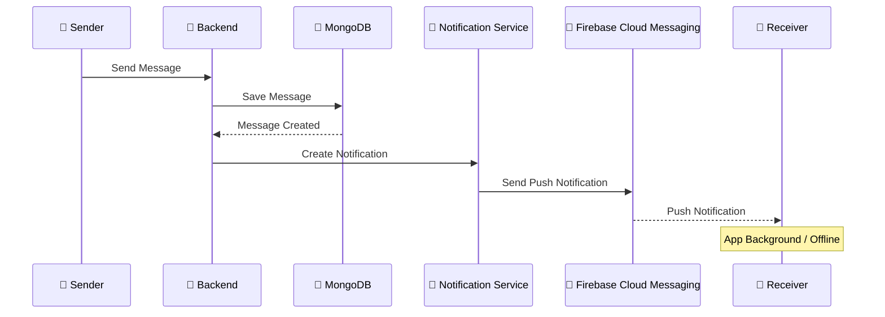

---

## 🧠 Redis Cache Flow

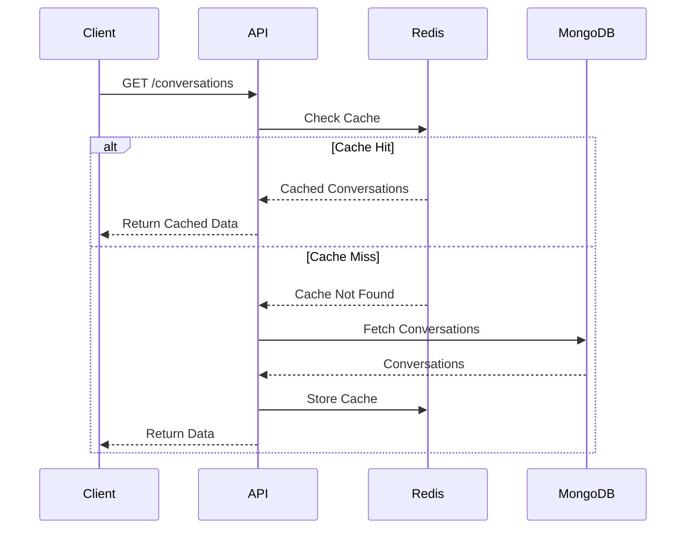

---

## 💬 Conversation Room Flow

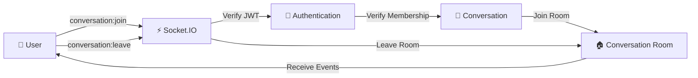

---

## 📦 Message Lifecycle

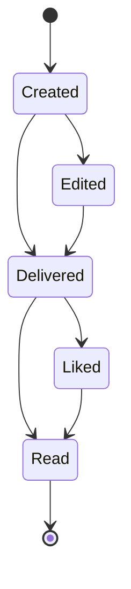


---

# 🐳 Docker Architecture

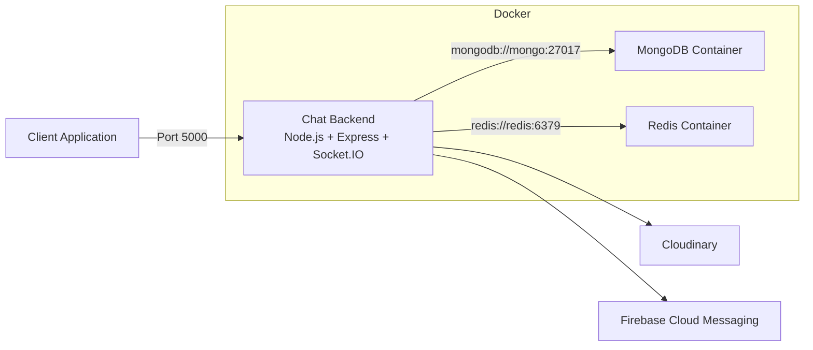

---

# 📁 Project Structure

```text
src/
│
├── cache/
│   ├── cache.keys.ts
│   └── cache.service.ts
│
├── config/
│   ├── cloudinary.ts
│   ├── db.ts
│   ├── env.ts
│   └── redis.ts
│
├── middleware/
│   ├── auth.middleware.ts
│   └── upload.middleware.ts
│
├── module/
│   │
│   ├── auth/
│   │   ├── auth.controller.ts
│   │   ├── auth.interface.ts
│   │   ├── auth.route.ts
│   │   ├── auth.service.ts
│   │   └── auth.validation.ts
│   │
│   ├── user/
│   │   ├── user.controller.ts
│   │   ├── user.interface.ts
│   │   ├── user.model.ts
│   │   ├── user.route.ts
│   │   └── user.service.ts
│   │
│   ├── conversation/
│   │   ├── conversation.controller.ts
│   │   ├── conversation.interface.ts
│   │   ├── conversation.model.ts
│   │   ├── conversation.route.ts
│   │   └── conversation.service.ts
│   │
│   ├── message/
│   │   ├── message.controller.ts
│   │   ├── message.interface.ts
│   │   ├── message.model.ts
│   │   ├── message.route.ts
│   │   └── message.service.ts
│   │
│   └── notification/
│       ├── notification.controller.ts
│       ├── notification.interface.ts
│       ├── notification.model.ts
│       ├── notification.route.ts
│       └── notification.service.ts
│
├── socket/
│   ├── socket.auth.ts
│   ├── socket.handlers.ts
│   ├── socket.server.ts
│   └── socket.types.ts
│
├── utils/
│   ├── cloudinary.ts
│   └── ...
│
├── app.ts
└── server.ts
```

---

# 🔐 Environment Variables

Create a `.env` file in the project root:

```env
PORT=5000
NODE_ENV=development

MONGO_URI=mongodb://localhost:27017/chat_app

REDIS_URL=redis://localhost:6379

JWT_SECRET=your-super-secret-key
JWT_EXPIRES_IN=7d

CLIENT_URL=http://localhost:3000

CLOUDINARY_CLOUD_NAME=your-cloudinary-cloud-name
CLOUDINARY_API_KEY=your-cloudinary-api-key
CLOUDINARY_API_SECRET=your-cloudinary-api-secret

FCM_PROJECT_ID=your-firebase-project-id
FCM_CLIENT_EMAIL=your-firebase-client-email
FCM_PRIVATE_KEY=your-firebase-private-key
```

> ⚠️ Never commit your `.env` file or Firebase credentials to GitHub.

---

# 🚀 Installation

## 1. Clone the Repository

```bash
git clone <repository-url>
```

## 2. Navigate to the Project

```bash
cd chat-application-backend
```

## 3. Install Dependencies

```bash
npm install
```

## 4. Configure Environment Variables

Create a `.env` file:

```text
.env
```

Then configure:

* MongoDB
* Redis
* JWT
* Cloudinary
* Firebase Cloud Messaging

## 5. Start Development Server

```bash
npm run dev
```

Expected output:

```text
MongoDB connected
Redis connecting...
Redis ready
Redis connected
Server running on http://localhost:5000
```

---

# 🐳 Run with Docker

## Start All Services

```bash
docker-compose up -d --build
```

This starts:

* Chat Backend
* MongoDB
* Redis

## Check Containers

```bash
docker-compose ps
```

## View Backend Logs

```bash
docker-compose logs -f app
```

## Stop Containers

```bash
docker-compose down
```

## Rebuild Containers

```bash
docker-compose up -d --build
```

---

# 🧠 Docker Service Configuration

Inside Docker, services communicate using service names.

```env
MONGO_URI=mongodb://mongo:27017/chat_app

REDIS_URL=redis://redis:6379
```

Inside Docker, do not use:

```text
localhost
```

Use the Docker service names instead:

```text
mongo
redis
```

---

# 🔄 REST API Flow

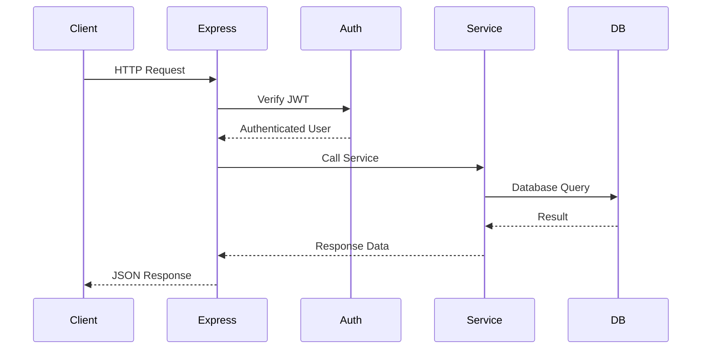

---

# 🔑 Authentication

Protected routes require a JWT access token.

```http
Authorization: Bearer YOUR_ACCESS_TOKEN
```

---

# 👤 User API

| Method | Endpoint                | Description         |
| ------ | ----------------------- | ------------------- |
| GET    | `/api/v1/users`         | Get all users       |
| GET    | `/api/v1/users/search`  | Search users        |
| GET    | `/api/v1/users/:id`     | Get user by ID      |
| PATCH  | `/api/v1/users/profile` | Update user profile |
| PATCH  | `/api/v1/users/avatar`  | Update user avatar  |

---

# 💬 Conversation API

## Create Direct Conversation

```http
POST /api/v1/conversations/direct
```

Example body:

```json
{
  "participantId": "USER_ID"
}
```

---

## Get My Conversations

```http
GET /api/v1/conversations
```

The conversation list uses Redis caching.

---

## Create Group Conversation

```http
POST /api/v1/conversations/group
```

Example body:

```json
{
  "name": "Developers Group",
  "participantIds": [
    "USER_ID_1",
    "USER_ID_2"
  ]
}
```

---

## Add Participants

```http
POST /api/v1/conversations/:id/participants
```

Example:

```json
{
  "participantIds": [
    "USER_ID"
  ]
}
```

---

## Remove Participant

```http
DELETE /api/v1/conversations/:id/participants/:userId
```

---

## Promote Member to Admin

```http
PATCH /api/v1/conversations/:id/admins/:userId
```

---

## Rename Group

```http
PATCH /api/v1/conversations/:id/name
```

Example:

```json
{
  "name": "New Group Name"
}
```

---

# 📨 Message API

## Send Message

```http
POST /api/v1/messages
```

Example:

```json
{
  "conversationId": "CONVERSATION_ID",
  "text": "Hello World"
}
```

The messaging system supports:

* Text Messages
* Media Messages
* Voice Messages
* Video Messages
* Message Replies
* Message Editing
* Message Likes

---

## Get Conversation Messages

```http
GET /api/v1/messages/conversation/:id?page=1&limit=30
```

Messages are returned to the chat UI in:

```text
Oldest → Newest
```

The database can fetch messages in reverse chronological order and return them in the correct display order for the chat interface.

---

# 📄 Message Pagination

Example:

```http
GET /api/v1/messages/conversation/CONVERSATION_ID?page=1&limit=30
```

Pagination structure:

```json
{
  "messages": [],
  "pagination": {
    "page": 1,
    "limit": 30,
    "total": 100,
    "totalPages": 4,
    "hasNextPage": true,
    "hasPreviousPage": false
  }
}
```

---

# ⚡ Socket.IO

The client connects using JWT authentication.

```ts
import { io } from "socket.io-client";

const socket = io("http://localhost:5000", {
  auth: {
    token: "YOUR_JWT_TOKEN"
  }
});
```

---

# 🔌 Socket Authentication Flow

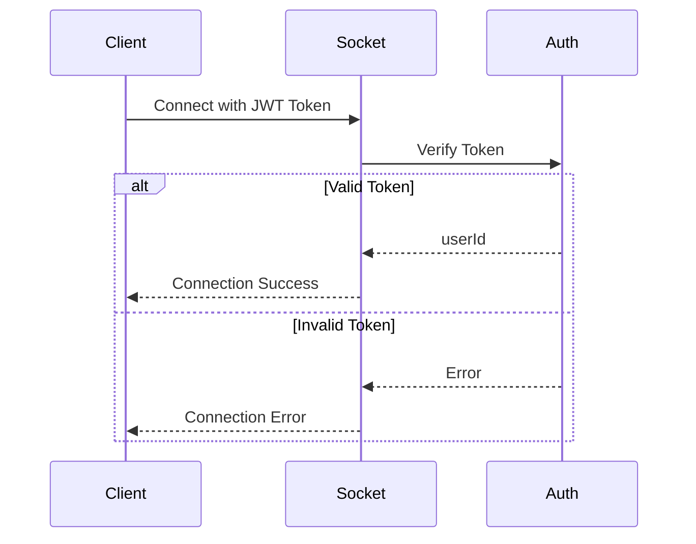

---

# 🚪 Conversation Room Events

## Join Conversation

```ts
socket.emit("conversation:join", {
  conversationId
});
```

Server response:

```ts
socket.on("conversation:joined", (data) => {
  console.log(data);
});
```

---

## Leave Conversation

```ts
socket.emit("conversation:leave", {
  conversationId
});
```

Server response:

```ts
socket.on("conversation:left", (data) => {
  console.log(data);
});
```

---

# 📨 Real-Time Message Flow

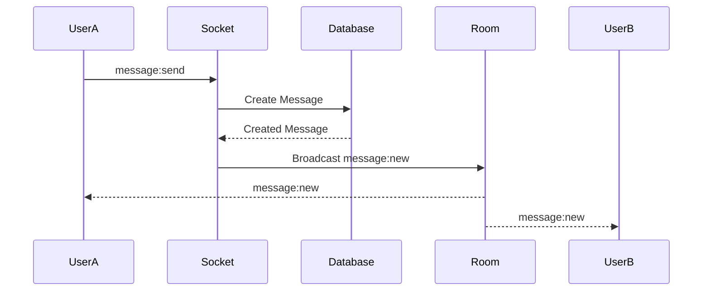

---

# 📨 Send Message Event

## Send

```ts
socket.emit("message:send", {
  conversationId,
  text: "Hello from Socket.IO"
});
```

## Receive

```ts
socket.on("message:new", (message) => {
  console.log(message);
});
```

---

# ⌨️ Typing Indicator

## Start Typing

```ts
socket.emit("typing:start", {
  conversationId
});
```

Receive:

```ts
socket.on("typing:start", (data) => {
  console.log(data);
});
```

## Stop Typing

```ts
socket.emit("typing:stop", {
  conversationId
});
```

Receive:

```ts
socket.on("typing:stop", (data) => {
  console.log(data);
});
```

---

# 📬 Message Delivery Status

When another participant receives a message:

```ts
socket.emit("message:delivered", {
  messageId
});
```

The sender receives:

```ts
socket.on("message:delivery:update", (data) => {
  console.log(data);
});
```

---

# 👁 Message Read Status

When the recipient reads a message:

```ts
socket.emit("message:read", {
  messageId
});
```

The sender receives:

```ts
socket.on("message:read:update", (data) => {
  console.log(data);
});
```

---

# 📬 Delivery & Read Flow

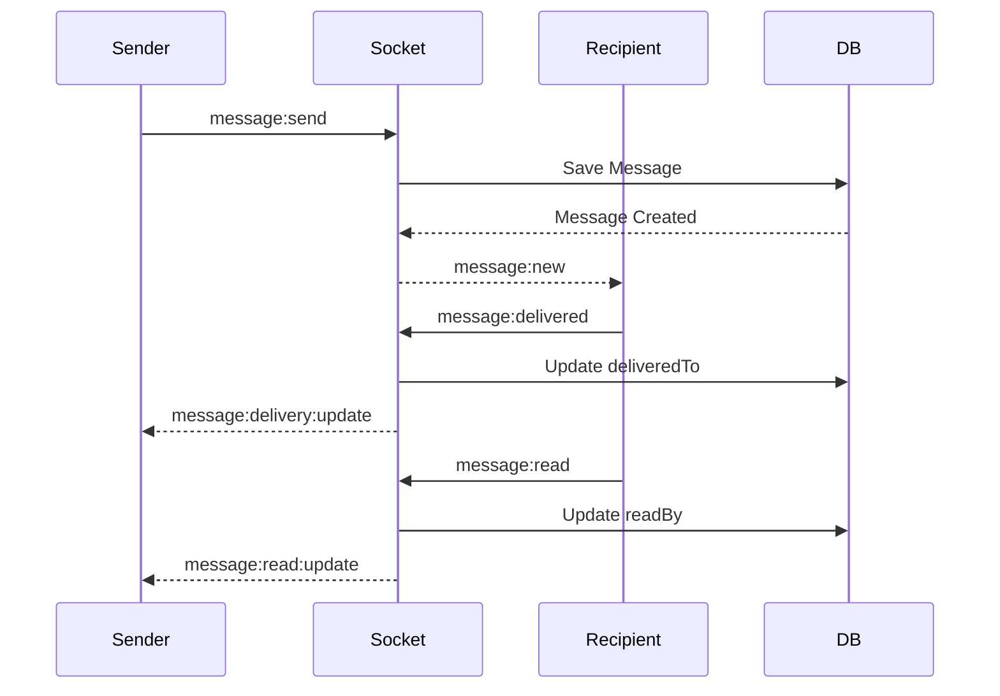

---

# 🧠 Redis Cache Flow

The conversation list uses Redis caching.

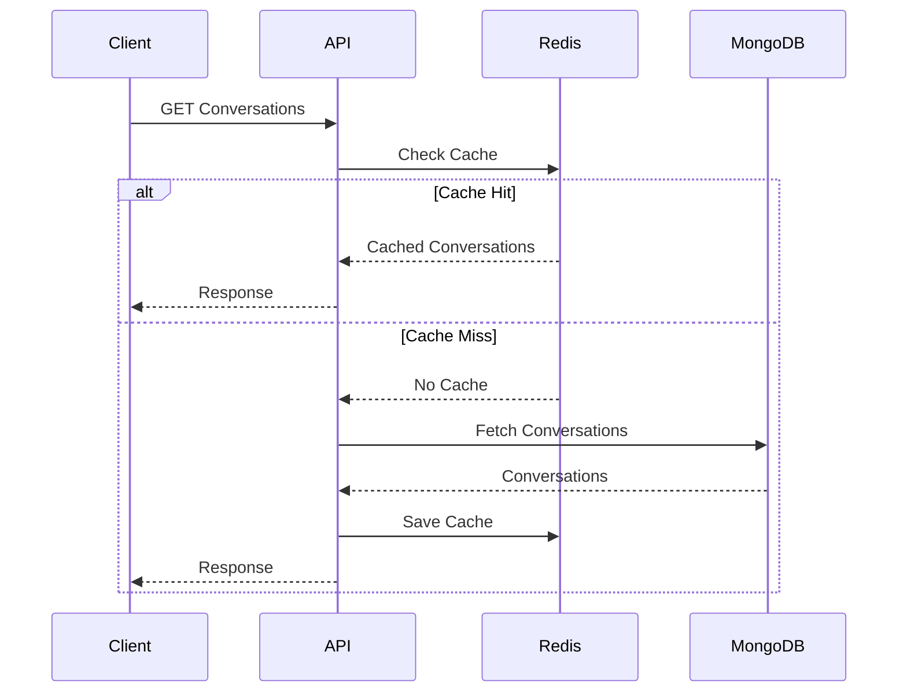

The cache is invalidated whenever relevant conversation data changes.

---

# 🟢 User Online / Offline Status

## When a Socket Connects

```text
Socket Connect
      ↓
JWT Authentication
      ↓
Extract User ID
      ↓
Set User Online
```

## When a Socket Disconnects

```text
Socket Disconnect
      ↓
Set User Offline
      ↓
Update Last Seen
```

---

# 🔔 Push Notifications

The application supports push notifications for users who are not actively viewing a conversation.

Notifications can be triggered for:

* New Messages
* Voice Messages
* Video Messages
* Message Replies
* Group Messages
* Group Activities

The notification system is separated from the real-time Socket.IO communication layer.

* Active users can receive real-time Socket.IO events.
* Background or offline users can receive push notifications.

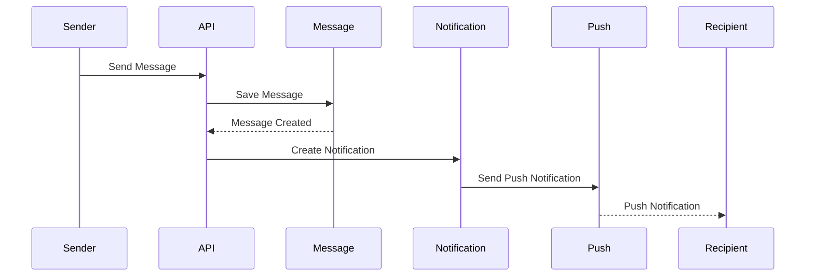

## Register Push Notification Token

```http
POST /api/v1/notifications/token
```


---

# 🧪 Testing

## TypeScript Check

```bash
npx tsc --noEmit
```

## Development Server

```bash
npm run dev
```

## Build

```bash
npm run build
```

## Production Server

```bash
npm start
```

---

# 🧪 Socket Testing

The real-time system can be tested using separate Socket.IO client scripts.

Example:

```bash
npx tsx socket-test-user-a.ts
```

And:

```bash
npx tsx socket-test-user-b.ts
```

This can be used to test:

* Conversation Joining
* Real-Time Messages
* Typing Events
* Delivery Status
* Read Status

---

# 🔄 Complete Real-Time Flow

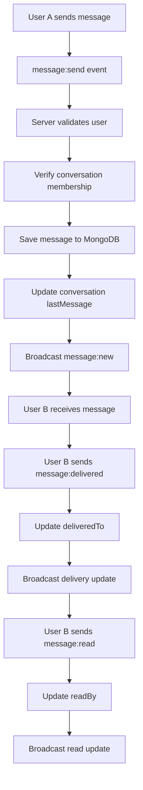

---

# 📦 Docker Commands

| Command                        | Description                |
| ------------------------------ | -------------------------- |
| `docker-compose up -d --build` | Build and start services   |
| `docker-compose ps`            | Show container status      |
| `docker-compose logs -f app`   | Show backend logs          |
| `docker-compose logs -f mongo` | Show MongoDB logs          |
| `docker-compose logs -f redis` | Show Redis logs            |
| `docker-compose down`          | Stop and remove containers |
| `docker-compose restart`       | Restart containers         |

---

# 📊 Project Status

```text
Authentication          ████████████████████ 100%
User Management         ████████████████████ 100%
Direct Conversation     ████████████████████ 100%
Group Conversation      ████████████████████ 100%
Messaging               ████████████████████ 100%
Real-Time Messaging     ████████████████████ 100%
Typing Indicator        ████████████████████ 100%
Delivery Status         ████████████████████ 100%
Read Status             ████████████████████ 100%
Message Reply           ████████████████████ 100%
Message Edit            ████████████████████ 100%
Message Like            ████████████████████ 100%
Voice Message           ████████████████████ 100%
Video Message           ████████████████████ 100%
Push Notifications      ████████████████████ 100%
Redis Cache             ████████████████████ 100%
Docker                  ████████████████████ 100%
```

---

# 👨‍💻 Author

**Aminul Haque**

Full Stack Developer

**MERN & PERN Stack**

---

## ⭐ Support

If you found this project useful, consider giving the repository a ⭐ on GitHub.
