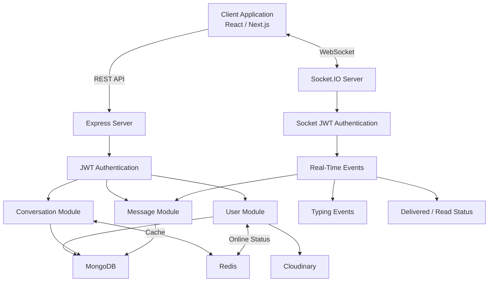
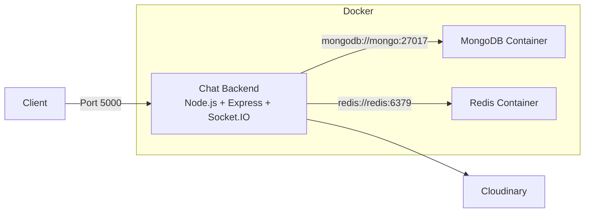
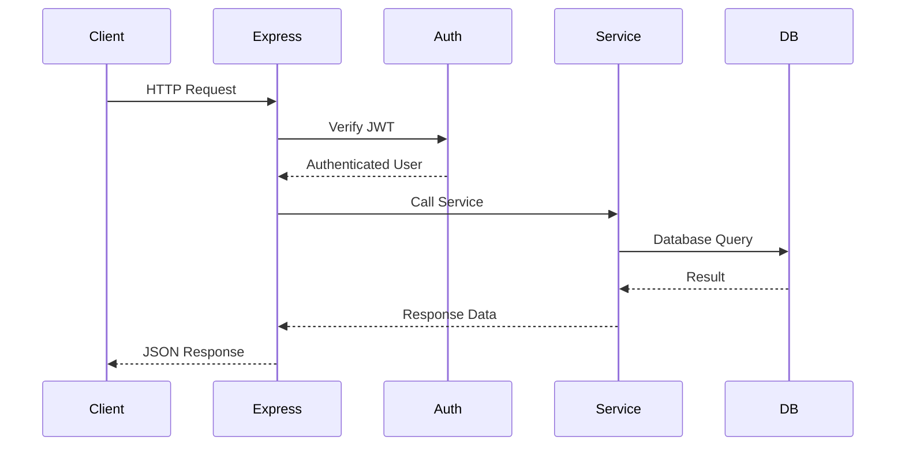
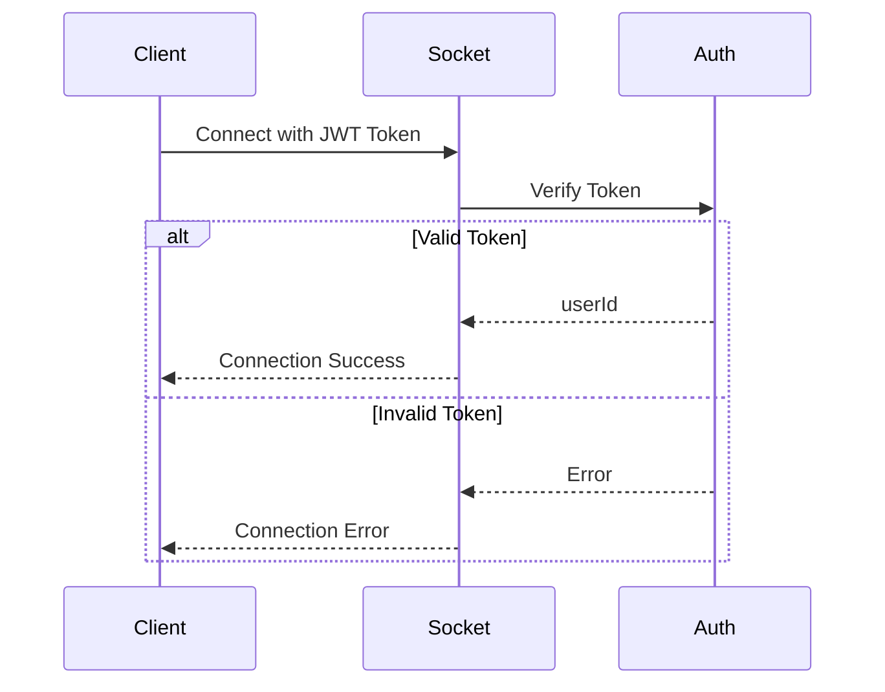
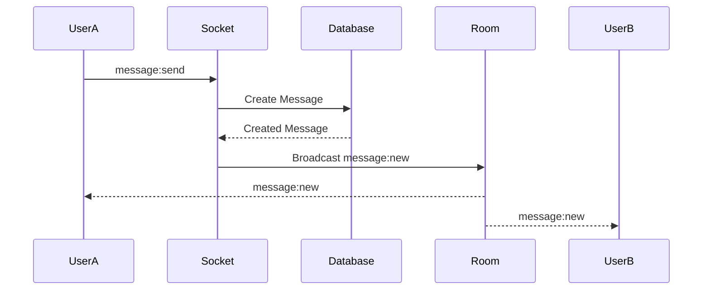
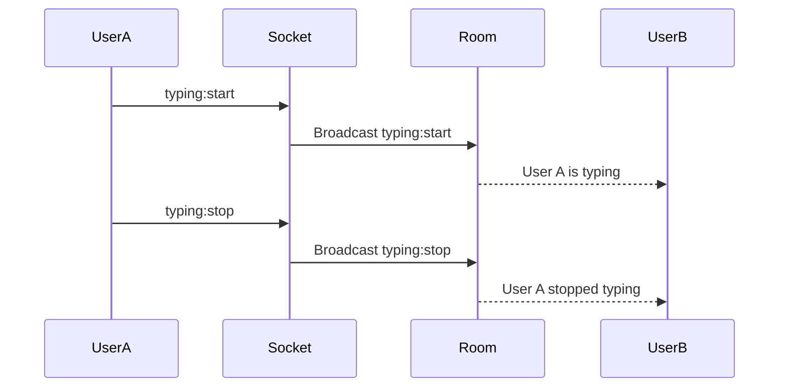
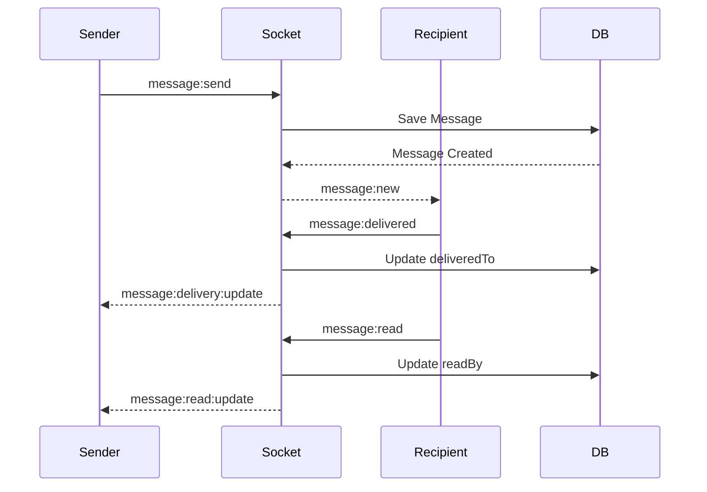
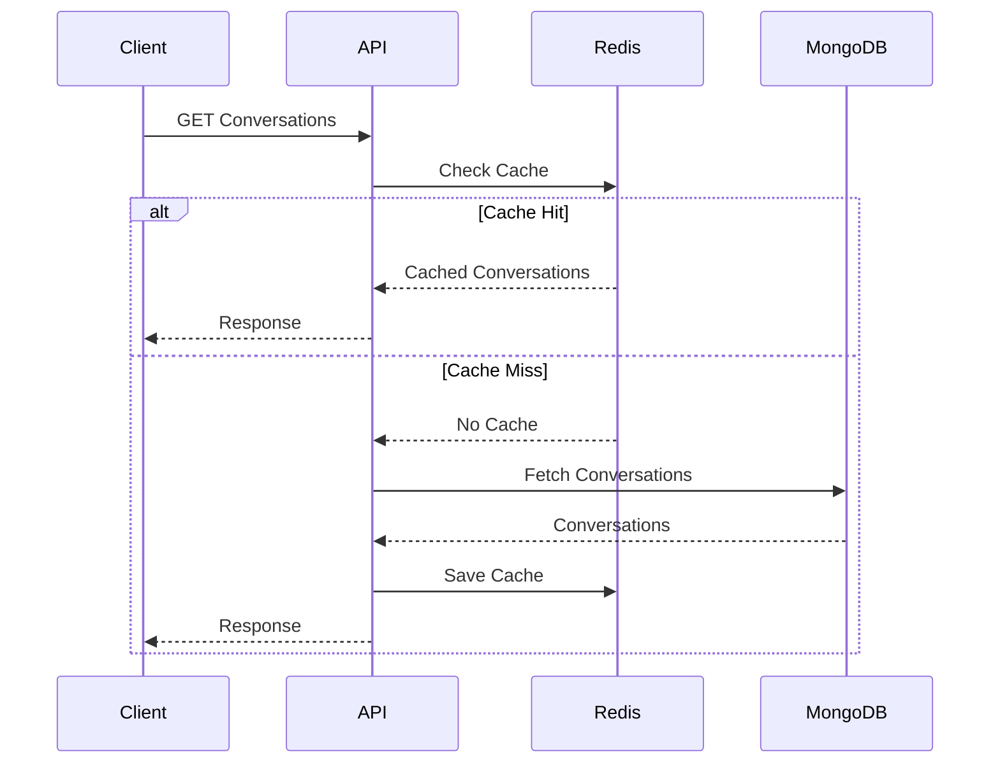
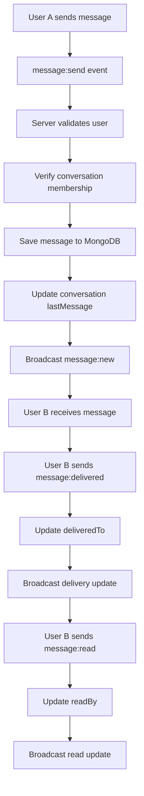

# Real-Time Chat Application Backend

A scalable and real-time chat application backend built with **Node.js, Express, TypeScript, MongoDB, Redis, Socket.IO, and Docker**.

The project supports authentication, direct and group conversations, real-time messaging, typing indicators, message delivery/read status, Redis caching, and containerized deployment.

---

## ✨ Features

* JWT Authentication
* User Profile Management
* Avatar Upload with Cloudinary
* Direct Conversations
* Group Conversations
* Group Participant Management
* Group Admin Management
* Group Rename
* Real-Time Messaging
* Socket.IO Authentication
* Conversation Room Management
* Typing Indicator
* Message Delivery Status
* Message Read Status
* Message Pagination
* Redis Caching
* MongoDB Database
* Docker Containerization
* Docker Compose
* TypeScript
* Input Validation
* Protected API Routes

---

# 🛠 Tech Stack

| Category                | Technology     |
| ----------------------- | -------------- |
| Runtime                 | Node.js        |
| Backend Framework       | Express.js     |
| Language                | TypeScript     |
| Database                | MongoDB        |
| ODM                     | Mongoose       |
| Cache                   | Redis          |
| Real-Time Communication | Socket.IO      |
| Authentication          | JWT            |
| Password Hashing        | bcrypt         |
| Image Storage           | Cloudinary     |
| Containerization        | Docker         |
| Container Orchestration | Docker Compose |

---

# 🏗 System Architecture



---

# 🐳 Docker Architecture



---

# 📁 Project Structure

```text
src/
│
├── cache/
│   ├── cache.keys.ts
│   └── cache.service.ts
│
├── config/
│   ├── db.ts
│   ├── env.ts
│   └── redis.ts
│
├── middleware/
│   ├── auth.middleware.ts
│   └── upload.middleware.ts
│
├── module/
│   │
│   ├── auth/
│   │   ├── auth.controller.ts
│   │   ├── auth.interface.ts
│   │   ├── auth.route.ts
│   │   ├── auth.service.ts
│   │   └── auth.validation.ts
│   │
│   ├── user/
│   │   ├── user.controller.ts
│   │   ├── user.interface.ts
│   │   ├── user.model.ts
│   │   ├── user.route.ts
│   │   └── user.service.ts
│   │
│   ├── conversation/
│   │   ├── conversation.controller.ts
│   │   ├── conversation.interface.ts
│   │   ├── conversation.model.ts
│   │   ├── conversation.route.ts
│   │   └── conversation.service.ts
│   │
│   └── message/
│       ├── message.controller.ts
│       ├── message.interface.ts
│       ├── message.model.ts
│       ├── message.route.ts
│       └── message.service.ts
│
├── socket/
│   ├── socket.auth.ts
│   ├── socket.handlers.ts
│   ├── socket.server.ts
│   └── socket.types.ts
│
├── app.ts
└── server.ts
```

---

# 🔐 Environment Variables

Create a `.env` file:

```env
PORT=5000

NODE_ENV=development

MONGO_URI=mongodb://localhost:27017/chat_app

REDIS_URL=redis://localhost:6379

JWT_SECRET=your-super-secret-key

JWT_EXPIRES_IN=7d

CLIENT_URL=http://localhost:3000

CLOUDINARY_CLOUD_NAME=your-cloudinary-cloud-name

CLOUDINARY_API_KEY=your-cloudinary-api-key

CLOUDINARY_API_SECRET=your-cloudinary-api-secret
```

> Never commit the `.env` file to GitHub.

---

# 🚀 Installation

## 1. Clone the Repository

```bash
git clone <repository-url>
```

## 2. Navigate to the Project

```bash
cd chat-application-backend
```

## 3. Install Dependencies

```bash
npm install
```

## 4. Configure Environment Variables

Create:

```text
.env
```

Then configure MongoDB, Redis, JWT, and Cloudinary credentials.

## 5. Start Development Server

```bash
npm run dev
```

Expected output:

```text
MongoDB connected
Redis connecting...
Redis ready
Redis connected
Server running on http://localhost:5000
```

---

# 🐳 Run with Docker

## Start All Services

```bash
docker-compose up -d --build
```

This starts:

* Chat Backend
* MongoDB
* Redis

## Check Containers

```bash
docker-compose ps
```

## View Backend Logs

```bash
docker-compose logs -f app
```

## Stop Containers

```bash
docker-compose down
```

## Rebuild Containers

```bash
docker-compose up -d --build
```

---

# 🧠 Docker Services

```text
chat-backend
      │
      ├──────────► MongoDB
      │
      └──────────► Redis
```

The backend connects to Docker services using:

```env
MONGO_URI=mongodb://mongo:27017/chat_app

REDIS_URL=redis://redis:6379
```

Inside Docker, do not use:

```text
localhost
```

for MongoDB or Redis container connections.

---

# 🔄 REST API Flow



---

# 🔑 Authentication

The protected routes require a JWT token.

```http
Authorization: Bearer YOUR_ACCESS_TOKEN
```

---

# 👤 User API

| Method | Endpoint                | Description         |
| ------ | ----------------------- | ------------------- |
| GET    | `/api/v1/users`         | Get all users       |
| GET    | `/api/v1/users/search`  | Search users        |
| GET    | `/api/v1/users/:id`     | Get user by ID      |
| PATCH  | `/api/v1/users/profile` | Update user profile |
| PATCH  | `/api/v1/users/avatar`  | Update user avatar  |

---

# 💬 Conversation API

## Create Direct Conversation

```http
POST /api/v1/conversations/direct
```

Example body:

```json
{
  "participantId": "USER_ID"
}
```

---

## Get My Conversations

```http
GET /api/v1/conversations
```

---

## Create Group Conversation

```http
POST /api/v1/conversations/group
```

Example:

```json
{
  "name": "Developers Group",
  "participantIds": [
    "USER_ID_1",
    "USER_ID_2"
  ]
}
```

---

## Add Participants

```http
POST /api/v1/conversations/:id/participants
```

Example:

```json
{
  "participantIds": [
    "USER_ID"
  ]
}
```

---

## Remove Participant

```http
DELETE /api/v1/conversations/:id/participants/:userId
```

---

## Promote Member to Admin

```http
PATCH /api/v1/conversations/:id/admins/:userId
```

---

## Rename Group

```http
PATCH /api/v1/conversations/:id/name
```

Example:

```json
{
  "name": "New Group Name"
}
```

---

# 📨 Message API

## Send Message

```http
POST /api/v1/messages
```

Example:

```json
{
  "conversationId": "CONVERSATION_ID",
  "text": "Hello World"
}
```

---

## Get Conversation Messages

```http
GET /api/v1/messages/conversation/:id?page=1&limit=30
```

Messages are returned in:

```text
Oldest → Newest
```

The database query uses:

```text
Newest → Oldest
```

and messages are reversed before returning them to the chat UI.

---

# 📄 Pagination

Example:

```http
GET /api/v1/messages/conversation/CONVERSATION_ID?page=1&limit=30
```

Response includes:

```json
{
  "messages": [],
  "pagination": {
    "page": 1,
    "limit": 30,
    "total": 100,
    "totalPages": 4,
    "hasNextPage": true,
    "hasPreviousPage": false
  }
}
```

---

# ⚡ Socket.IO

The client connects using JWT authentication.

```ts
import { io } from "socket.io-client";

const socket = io(
  "http://localhost:5000",
  {
    auth: {
      token: "YOUR_JWT_TOKEN"
    }
  }
);
```

---

# 🔌 Socket Authentication Flow



---

# 🚪 Conversation Room Events

## Join Conversation

Client:

```ts
socket.emit(
  "conversation:join",
  {
    conversationId
  }
);
```

Server response:

```ts
socket.on(
  "conversation:joined",
  (data) => {
    console.log(data);
  }
);
```

---

## Leave Conversation

Client:

```ts
socket.emit(
  "conversation:leave",
  {
    conversationId
  }
);
```

Server response:

```ts
socket.on(
  "conversation:left",
  (data) => {
    console.log(data);
  }
);
```

---

# 📨 Real-Time Message Flow



---

# 📨 Send Message Event

Client:

```ts
socket.emit(
  "message:send",
  {
    conversationId,
    text: "Hello from Socket.IO"
  }
);
```

Receive:

```ts
socket.on(
  "message:new",
  (message) => {
    console.log(message);
  }
);
```

---

# ⌨️ Typing Indicator

## Start Typing

```ts
socket.emit(
  "typing:start",
  {
    conversationId
  }
);
```

Receive:

```ts
socket.on(
  "typing:start",
  (data) => {
    console.log(data);
  }
);
```

---

## Stop Typing

```ts
socket.emit(
  "typing:stop",
  {
    conversationId
  }
);
```

Receive:

```ts
socket.on(
  "typing:stop",
  (data) => {
    console.log(data);
  }
);
```

---

# ⌨️ Typing Flow



---

# 📬 Message Delivery Status

When another participant receives a message:

```ts
socket.emit(
  "message:delivered",
  {
    messageId
  }
);
```

Delivery update:

```ts
socket.on(
  "message:delivery:update",
  (data) => {
    console.log(data);
  }
);
```

---

# 👁 Message Read Status

When the recipient reads a message:

```ts
socket.emit(
  "message:read",
  {
    messageId
  }
);
```

Read update:

```ts
socket.on(
  "message:read:update",
  (data) => {
    console.log(data);
  }
);
```

---

# 📬 Delivery and Read Flow



---

# 🧠 Redis Cache Flow

The conversation list uses Redis caching.



Cache is invalidated when conversation data changes.

---

# 🟢 User Online/Offline Status

When a socket connects:

```text
Socket Connect
      ↓
JWT Authentication
      ↓
Extract User ID
      ↓
Set User Online
```

When a socket disconnects:

```text
Socket Disconnect
      ↓
Set User Offline
      ↓
Update Last Seen
```

---

# 🧪 Testing

## TypeScript Check

```bash
npx tsc --noEmit
```

## Development Server

```bash
npm run dev
```

## Build

```bash
npm run build
```

## Production Server

```bash
npm start
```

---

# 🧪 Socket Testing

The project can be tested using separate Socket.IO client scripts.

Example:

```bash
npx tsx socket-test-user-a.ts
```

And:

```bash
npx tsx socket-test-user-b.ts
```

This can be used to test:

* Conversation joining
* Real-time messages
* Typing events
* Delivery status
* Read status

---

# 🔄 Complete Real-Time Flow



---

# 📦 Docker Commands

| Command                        | Description                |
| ------------------------------ | -------------------------- |
| `docker-compose up -d --build` | Build and start services   |
| `docker-compose ps`            | Show container status      |
| `docker-compose logs -f app`   | Show backend logs          |
| `docker-compose logs -f mongo` | Show MongoDB logs          |
| `docker-compose logs -f redis` | Show Redis logs            |
| `docker-compose down`          | Stop and remove containers |
| `docker-compose restart`       | Restart containers         |

---

# 📊 Project Status

```text
Authentication         ████████████████████ 100%
User Management        ████████████████████ 100%
Direct Conversation    ████████████████████ 100%
Group Conversation     ████████████████████ 100%
Messaging              ████████████████████ 100%
Real-Time Messaging    ████████████████████ 100%
Typing Indicator       ████████████████████ 100%
Delivery Status        ████████████████████ 100%
Read Status            ████████████████████ 100%
Redis Cache            ████████████████████ 100%
Docker                 ████████████████████ 100%
```

---

# 🎯 Future Improvements

* [ ] Message editing
* [ ] Message deletion
* [ ] Message reactions
* [ ] Reply to messages
* [ ] File and media messages
* [ ] Voice messages
* [ ] Push notifications
* [ ] Unread message count
* [ ] Socket scaling with Redis Adapter
* [ ] Rate limiting
* [ ] Refresh token authentication
* [ ] Automated testing
* [ ] CI/CD pipeline
* [ ] Production deployment

---

# 👨‍💻 Author

**Aminul Haque**

Full Stack Developer

**MERN & PERN Stack**

---

## ⭐ Support

If you found this project useful, consider giving the repository a ⭐ on GitHub.
